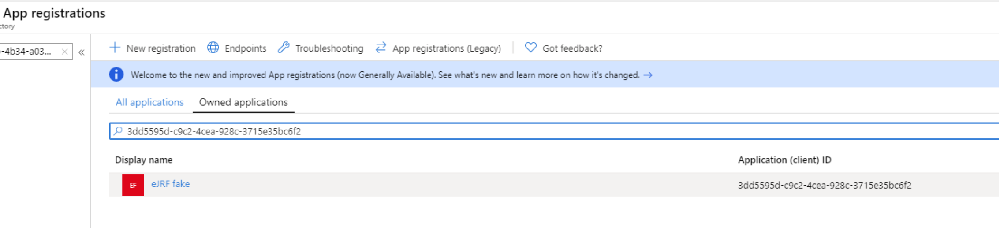
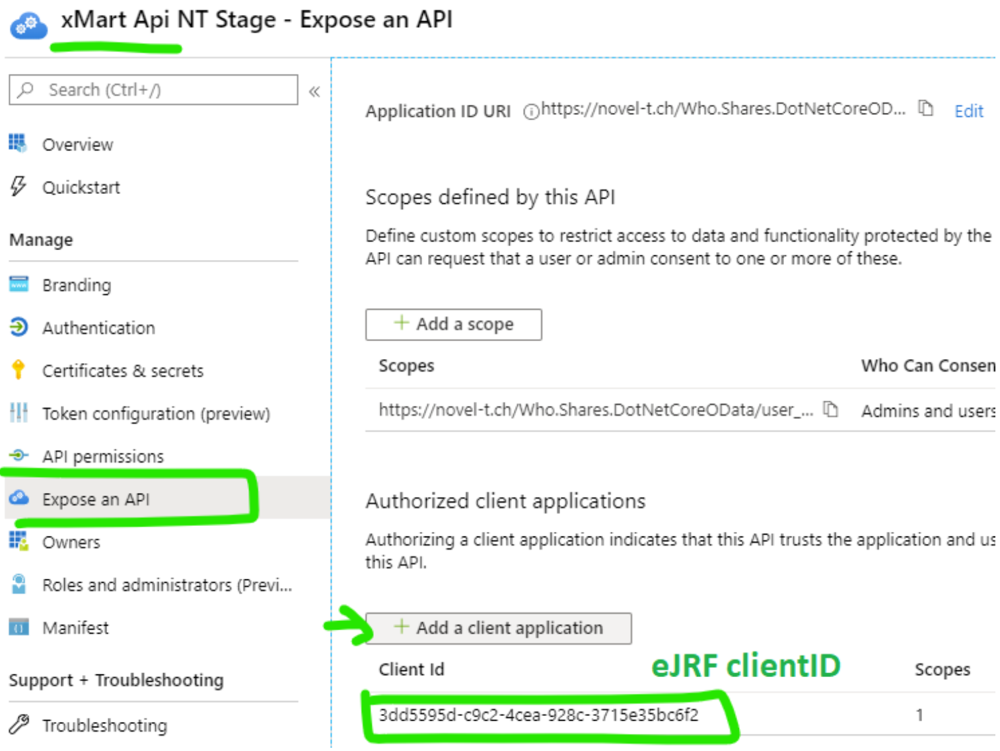
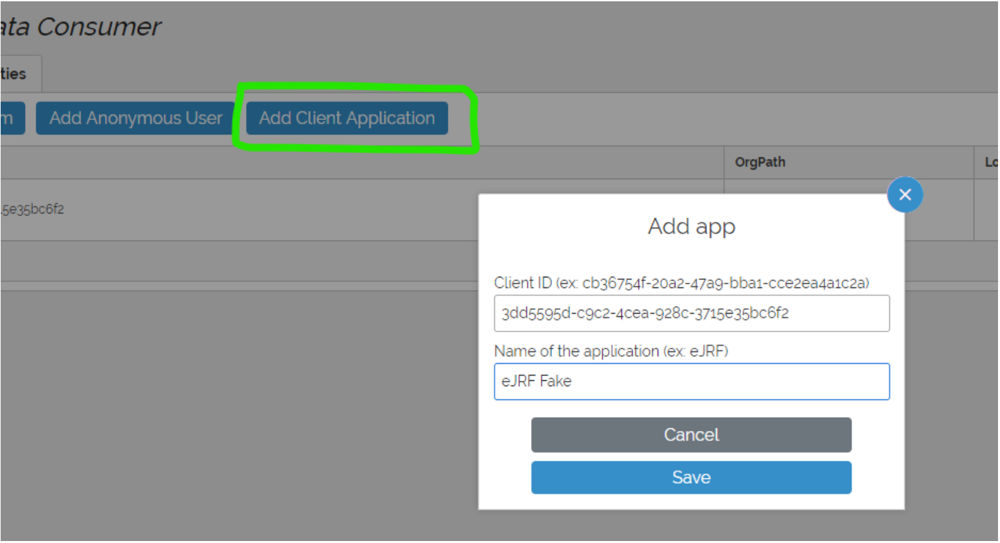

```{r, include = FALSE}
knitr::opts_chunk$set(
  collapse = TRUE,
  comment = "#>",
  echo = FALSE
)
```
If a remote client application needs to securely access an xMart4 database, specific permissions must be set up in the WHO AzureAD. The below tutorial takes you through the steps to establish this connection.

## Remote client app configuration

```{r, out.width = "70%", fig.cap = "Create or retrieve AzureAD app clientID."}

```

In the [AzureAD portal](https://portal.azure.com/#blade/Microsoft_AAD_IAM/ActiveDirectoryMenuBlade/RegisteredApps) get the Application (client ID) of the application that needs access to the xMart API. If the application does not exist, create it or request it to Chris Tantillo. Let's call this clientID `remoteClientID` for future references.

```{r, out.width = "50%", fig.cap = "Generate a client secret."}
knitr::include_graphics("xmart4-azure-setup_insertimage_3.png")
```

In the same AzureAD page, click Certificates & Secrets > New client secret. We'll refer to this secret by `remoteClientSecret`.

## xMart API app configuration

This step should be done by the xMart API owner (one of Chris Tantillo, Chris Faulkner, or Thyiag) in Azure in order to allow your application to consume xMart API data.


```{r, out.width = "50%", fig.cap = "Expose an API in xMart > Add a Client application"}

```

In WHO AzureAD Portal, find xMart API (Env) in App Registrations. Get the clientID, we'll call it `xmartapiClientID`. It will need to provided to the remote app developer.

* Value for UAT, `xmartapiClientID: b85362d6-c259-490b-bd51-c0a730011bef`
* Value for PROD, `xmartapiClientID: 712b0d0d-f9c5-4b7a-80d6-8a83ee014bca`

Open the app and select **Expose an API**, click **Add a client application** and paste the `remoteClientID`.

```{r, out.width = "50%", fig.cap = "Configure xMart role > Add Client Application"}

```

In xMart Admin UI of your mart, create or use an existing role that has DATA_VIEW permission for the mart or view(s) that need to be consumed by the remote app. Then, in Users, click the Add a Client application button. Fill in the remoteClientID received from previous step and wisely chosen friendly name. From here, you will be shown how to use the `remoteClientID` and `remoteClientSecret` in the xmart4 R package.
